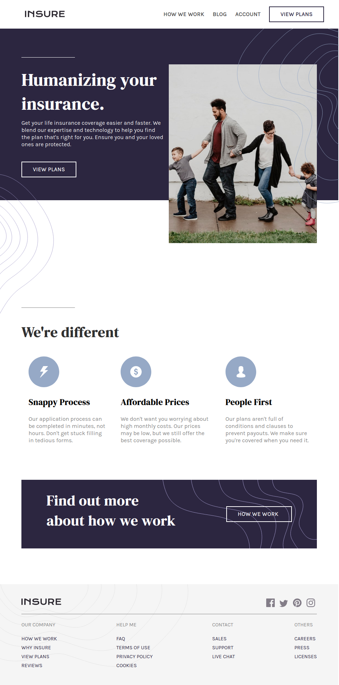

# Frontend Mentor - Insure Landing Page (React)

This is the source code for the **Insure Landing Page** project, built as part of a challenge from [Frontend Mentor](https://www.frontendmentor.io/). The project is built using **React** and designed to match the requirements outlined in the challenge.

You can view the live demo of the project [here](https://neutrovertido.github.io/frontendmentor-insure-react/).

## Table of Contents

- [Overview](#overview)
- [Features](#features)
- [Tech Stack](#tech-stack)
- [Installation](#installation)
- [Usage](#usage)
- [Contributing](#contributing)
- [License](#license)

## Overview

This project is a landing page for an insurance company, showcasing a modern, clean design with a responsive layout. The design and functionality are inspired by the FrontEndMentor challenge, and it is built using React.

### Screenshot


## Features

- Responsive design that works on mobile and desktop.
- Modern layout with a desktop-first approach.
- Clean UI with a focus on user experience.
- Implemented with React for easy scalability and component management.

## Tech Stack

- **React**: JavaScript library for building user interfaces.
- **CSS**: For styling the page with a responsive layout.
- **JavaScript**: Used for implementing React.

## Installation

To run the project locally, follow these steps:

1. Clone the repository:
   ```bash
   git clone https://github.com/neutrovertido/frontendmentor-insure-react.git
   ```
2. Install dependencies:
    ```bash
    npm install
    ```
3. Run the app:
    ```bash
    npm start
    ```

## Usage

- Open the project in your browser to explore the landing page.
- The design is responsive across mobile, tablet, and desktop devices.

## Contributing

Feel free to fork the repository and submit pull requests.

## License

This project is licensed under the [MIT License](LICENSE).

---

Built with ❤️ by [Neutrovertido](https://github.com/neutrovertido)
